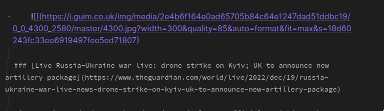
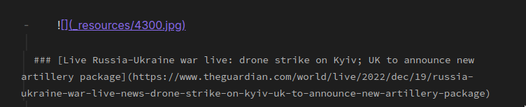

# Obsidian Local Images Plus


Obsidian Local Images is a plugin for [Obsidian](https://obsidian.md/) desktop (mobile version in the plans). 

The plugin finds all links to external images in your notes, downloads and saves images locally and finally adjusts the link in your note to point to the local image files.


**This plugin is in development process, so your ideas and donations are very appreciated.**

## Installation

- Download the latest version from github or the github page of the project.
- Extract the archive into your obsidian vault (e.g. Myvault/.obsidian/plugins)
- Restart Obsidian.
- Open "Community plugins" dialog and change plugin settings at will.
- Enjoy


## Usage

Just copy any web content from a page and paste it into your note.


Use it with commands mode or in timer mode:


```Download images locally``` - your active page will be processed.

or

```Download images locally for all your notes``` - will be processed all the pages in your vault, that corresponds to **Include** parameter in the plugin's settings.

Also you can turn on in plugin's settings processing the active page when external links pasted into the page.
 







**Some upcoming plugin features will be added in this readme on the course of releasing new versions.**


## Credits

[niekcandaele's](https://github.com/niekcandaele/obsidian-local-images)

[aleksey-rezvov](https://github.com/aleksey-rezvov/obsidian-local-images)


## Development

```
# To build from source
npm run dev
npm run build
```